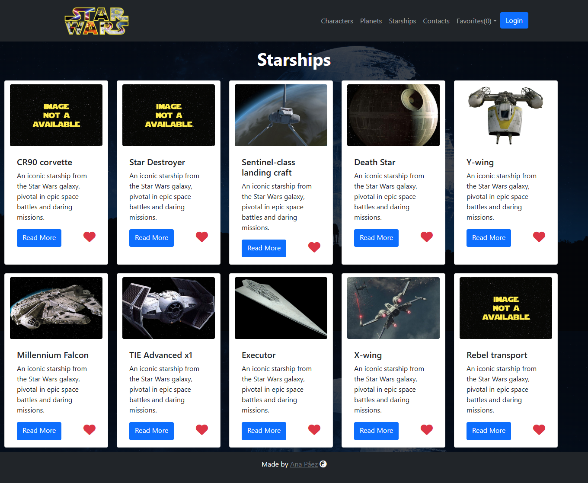

# Star War Blog 🌠
**...Welcome to a Galaxy Far, Far Away...**  

Star Wars Blog is a project where you can find information about characters, planets, and starships from one of the most incredible movie sagas ever made. You can create a user profile, save your favorite characters, planets, or starships, and even create contacts.

---

## Key Features 🌟 

1. **Explore the Universe**: Access detailed information about iconic Star Wars characters, planets, and starships.
2. **Create Your Profile**: Set up a personal account to save your favorite characters, planets, and starships.  
3. **Favorites Collection**: Easily mark and keep track of your top characters, planets, and starships.
4. **Create Contacts**: Connect with fellow fans by creating and managing contacts within the app.  
5. **User-Friendly Interface**: Navigate effortlessly through the app with an intuitive design and smooth user experience. 
6. **Stay Updated:**: Get the latest updates and news related to the Star Wars universe.

---

## Technologies Used 🚀 

### **Frontend**  
- **HTML5**: Semantic content structure.  
- **CSS3**: Custom styles for a responsive design.  
- **Bootstrap**: Quick components and responsive grid systems.  
- **JavaScript**: Interactivity and client-side logic.  
- **React.js**: Reusable components and state management with Flux.  

### **Backend**  
- **Python**: Server-side logic and data handling.  
- **Flask**: Framework for routing, authentication, and database connections.  
- **APIs**: Integration of external services to fetch up-to-date information about Star Wars characters, planets, and starships from trusted sources.

### **State & Data Management**  
- **Flux**: Global state management.  
---

## Screenshots 📷 

### Characters Section  

### Planets Section  

### Starships Section  

### Contacts Section & Favorites

### Add Contact Section  

---

  <strong>May the Force Be With You</strong>
   
  

